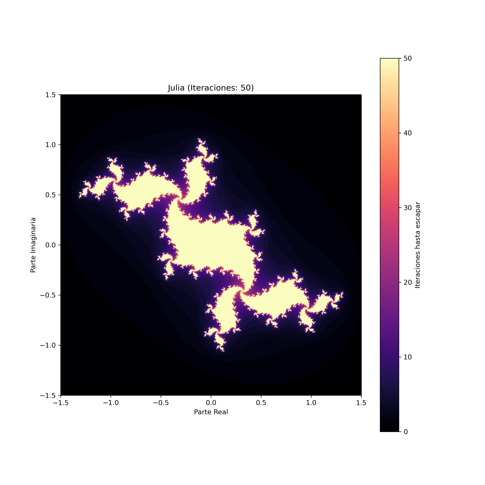

# Generador de Fractales

Generador de fractales de Mandelbrot y Julia con soporte para GPU mediante CuPy.

## Ejemplos

### Mandelbrot (Modo Fotográfico)


### Julia (Modo Normal)


## Requisitos

```bash
pip install numpy matplotlib
# Opcional para GPU:
pip install cupy-cuda11x  # o cupy-cuda12x según tu versión de CUDA
```

## Estructura de archivos

```
.
├── main.py           # Punto de entrada principal
├── config.py         # Configuración de parámetros
├── mandelbrot.py     # Generador de Mandelbrot
├── julia.py          # Generador de Julia
├── ejemplos/         # Imágenes de ejemplo
│   ├── mandelbrot.png
│   └── julia.png
└── out/
    ├── mandelbrot/   # Imágenes de Mandelbrot generadas
    └── julia/        # Imágenes de Julia generadas
```

## Uso

Ejecuta el programa principal:

```bash
python main.py
```

Se mostrará un menú con las opciones:
- **1**: Generar fractal de Mandelbrot
- **2**: Generar fractal de Julia
- **0**: Salir

## Configuración

Edita `config.py` para personalizar los fractales:

### Mandelbrot
- `MANDELBROT_X_MIN`, `MANDELBROT_X_MAX`: Rango horizontal
- `MANDELBROT_Y_MIN`, `MANDELBROT_Y_MAX`: Rango vertical
- `MANDELBROT_ALTO`, `MANDELBROT_ANCHO`: Resolución de la imagen
- `MANDELBROT_ITERACIONES`: Número de iteraciones (más = más detalle)
- `MANDELBROT_PHOTO_MODE`: `True` para solo guardar imagen, `False` para mostrar con ejes

### Julia
- `JULIA_X_MIN`, `JULIA_X_MAX`: Rango horizontal
- `JULIA_Y_MIN`, `JULIA_Y_MAX`: Rango vertical
- `JULIA_C_REAL`, `JULIA_C_IMAG`: Constante compleja del fractal
- `JULIA_ALTO`, `JULIA_ANCHO`: Resolución de la imagen
- `JULIA_ITERACIONES`: Número de iteraciones
- `JULIA_PHOTO_MODE`: `True` para solo guardar imagen, `False` para mostrar con ejes

### General
- `COLORMAP`: Paleta de colores (ej: 'magma', 'viridis', 'hot', 'cool')
- `DPI`: Resolución de guardado (300 por defecto)

## Aceleración GPU

El programa detecta automáticamente si CuPy está instalado y usa la GPU para cálculos más rápidos. Si no está disponible, usa NumPy con CPU.

## Salidas

Las imágenes se guardan en:
- `out/mandelbrot/mandelbrot_zoom.png`
- `out/julia/Julia.png`

Asegúrate de crear las carpetas `out/mandelbrot/` y `out/julia/` antes de ejecutar.

## Coordenadas Interesantes de Mandelbrot

Aquí tienes algunas regiones fascinantes para explorar en el fractal de Mandelbrot. Copia estas coordenadas en `config.py`:

```python
# Vista completa
MANDELBROT_X_MIN, MANDELBROT_X_MAX = -2.0, 1.0
MANDELBROT_Y_MIN, MANDELBROT_Y_MAX = -1.5, 1.5

# Bahía de los Elefantes
MANDELBROT_X_MIN, MANDELBROT_X_MAX = -0.7445, -0.7425
MANDELBROT_Y_MIN, MANDELBROT_Y_MAX = 0.1305, 0.1325

# Valle de los Caballitos de Mar
MANDELBROT_X_MIN, MANDELBROT_X_MAX = -0.747, -0.743
MANDELBROT_Y_MIN, MANDELBROT_Y_MAX = 0.110, 0.114

# Mini-Mandelbrot
MANDELBROT_X_MIN, MANDELBROT_X_MAX = -1.253, -1.249
MANDELBROT_Y_MIN, MANDELBROT_Y_MAX = 0.017, 0.021

# Espiral infinita
MANDELBROT_X_MIN, MANDELBROT_X_MAX = -0.7618, -0.7612
MANDELBROT_Y_MIN, MANDELBROT_Y_MAX = -0.0852, -0.0846

# Plumas fractales
MANDELBROT_X_MIN, MANDELBROT_X_MAX = -0.7275, -0.7265
MANDELBROT_Y_MIN, MANDELBROT_Y_MAX = 0.1875, 0.1885
```


**Consejo**: A mayor zoom (rango más pequeño), necesitarás más iteraciones para ver los detalles. Empieza con 300-500 iteraciones y ajusta según el resultado.